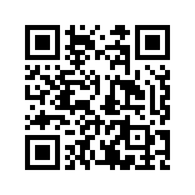

  
  
  

<h1 align="center">🚀 BIND9 DNS Server Auto Installer</h1>

  <i>Management Server PPP Mikrotik Via API Sederhana Dan Compact</i>

---

# 🌐 WebPPPServer with JSON + PHP

Repository ini berisi **Web PPP Server** berbasis PHP dengan integrasi **JSON API** untuk autentikasi MikroTik.  
Dapat digunakan untuk manajemen user VPN, login, dan monitoring sederhana.  

---

## 🚀 Tata Cara Upload & Konfigurasi

### 1. Upload ke Web Server
- Copy seluruh file ke direktori web server kamu, misalnya:
  - **Apache/Nginx**: `/var/www/html/webpppserver/`

### 2. Konfigurasi MikroTik
Buka file konfigurasi yang berisi koneksi MikroTik, lalu ubah sesuai dengan data router kamu:

// KONFIGURASI MikroTik
$MT_HOST = "ip-public-mikrotik/vpn";
$MT_USER = "user-mikrotik";
$MT_PASS = "password-mikrotik";
$MT_HOST → Isi dengan IP Public / domain MikroTik kamu

$MT_USER → Username MikroTik

$MT_PASS → Password MikroTik

3. Konfigurasi Login Web
Edit file auth_check.php untuk mengatur login ke halaman web panel:

php
Salin
Edit
// Konfigurasi login
$WEB_USER = "admin";
$WEB_PASS = "password";
Ganti admin dan password sesuai dengan keinginanmu.

4. Akses Web Panel
Buka browser, lalu akses:

arduino
Salin
Edit
http://IP-SERVER/webpppserver/
Login menggunakan Username & Password Web yang sudah kamu atur.

📌 Catatan
Pastikan php-curl aktif di server kamu.

## ❤️ Support Project Ini
Kalau script ini bermanfaat, kamu bisa traktir kopi ☕ lewat PayPal:  

---

👉 [paypal.me/ekiguistian](https://www.paypal.me/ekiguistian22)

Atau scan QR berikut:  

---

✍️ Created with ❤️ by **Leo Ganteng**

---

  ❤️ Created by <b>Leo Ganteng</b> | 
  ☕ Support me via <a href="https://www.paypal.me/ekiguistian22">PayPal</a>

  
  

👨‍💻 Author
Created by Leo Ganteng
📧 Email: ekiguistian@gmail.com
🌐 GitHub: github.com/ekiguistian22

✨ Terima kasih sudah menggunakan project ini!
